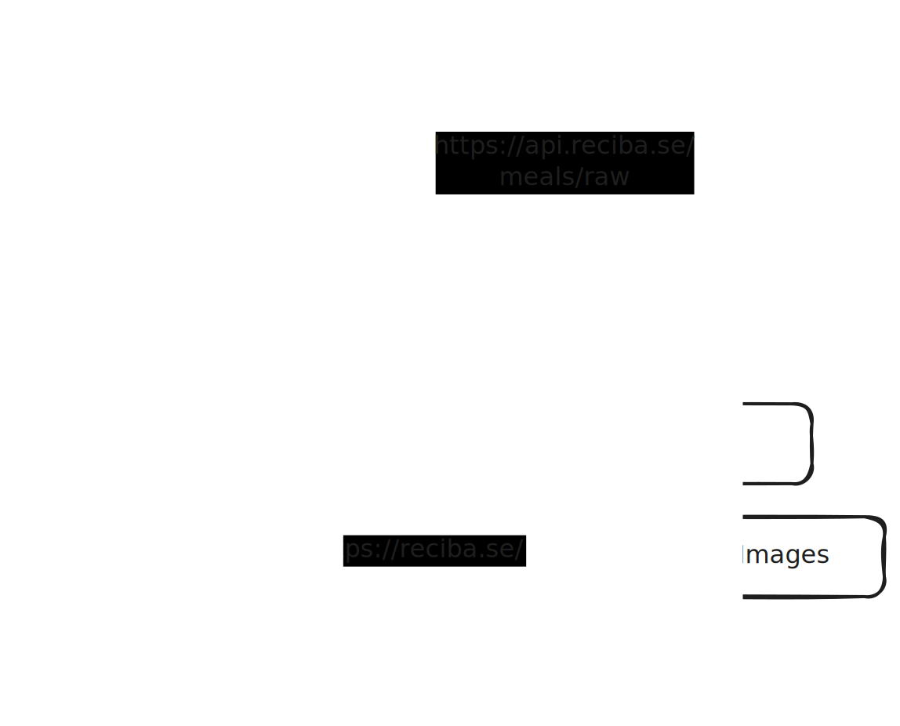

# Recibase


Recibase is a recipe ingestion and navigation service, designed to ease the choosing of what to cook.

Recibase works like so:

1. Write [Scala files][recipes] containing or linking to your recipes
2. Recibase spins up [a recipe API][recipe-api]
3. [The frontend][frontend] lets you browse recipes by name, ingredient and more

There is also a separate [CDN][recipe-images] to host images of the cooked recipes and a [Meal Chooser][meal-chooser] for filtering a complete list of everything we cook.

## Platform Architecture



## Roadmap

Recibase is a long term project which will grow depending on what features are useful or interesting to develop. The current plan is:

1. ~~Standardise ingredients schema~~
2. ~~Add a bunch of recipes~~
3. ~~Add any small but useful features to improve frontend~~
4. Improve ingestion debugging capabilities (churn/reporting/etc.)
5. Continue to develop schema
6. Migrate frontend to separate React client and REST API
7. Add microservices for useful client-side functionality (favouriting, etc.)
8. ???
9. Profit

## Requirements

- SBT
- Java 17

## Usage

1. Clone Recibase
2. Open a command prompt inside the cloned repo
3. `sbt run`
4. Wait until the program says `started at http://[::]:8081/`
5. Visit `localhost:8081/recipes/`

If you want to use the web interface you'll need to set up the [frontend][frontend] too

## Contributing/Questions

If you have any questions or want to help out feel free to [open an issue][new-issue]

### How to tag meals

Meals that we cook are defined in two places:
- [Entire recipes](https://github.com/The-Silverwood-Institute/Recibase/tree/master/src/main/scala/se/reciba/api/recibase/recipes): Ingredients, preparation steps and more
- [Meal Stubs](https://github.com/The-Silverwood-Institute/Recibase/blob/master/src/main/scala/se/reciba/api/recibase/MealDefinitions.scala): References to full recipes stored elsewhere or from memory. They're like library reference cards

Both have tags, to help with filtering our list of meals in order to choose what to cook. Tags are defined [here](https://github.com/The-Silverwood-Institute/Recibase/blob/master/src/main/scala/se/reciba/api/recibase/model/Tag.scala). Every recipe has tags defined as a comma separated list inside the recipe's file, like so:
```scala
val tags = Set(Tag.Vegetarian, Tag.Slow, Tag.Scales)
```
Every Meal Stub has its tags defined as the 2nd parameter:
```scala
MealStub("Aubergine curry", Set(Tag.Vegan, Tag.Scales, Tag.Slow))
```
The 3rd parameter is an optional link to the full recipe, which is only defined if that recipe exists on the internet.

[recipes]: https://github.com/The-Silverwood-Institute/Recibase/tree/master/src/main/scala/com/herokuapp/recibase/recipes
[recipe-api]: https://api.reciba.se/
[frontend]: https://github.com/The-Silverwood-Institute/Frontend
[new-issue]: https://github.com/The-Silverwood-Institute/Recibase/issues/new
[recipe-images]: https://github.com/The-Silverwood-Institute/Recipe-Images/
[meal-chooser]: https://c.reciba.se/
